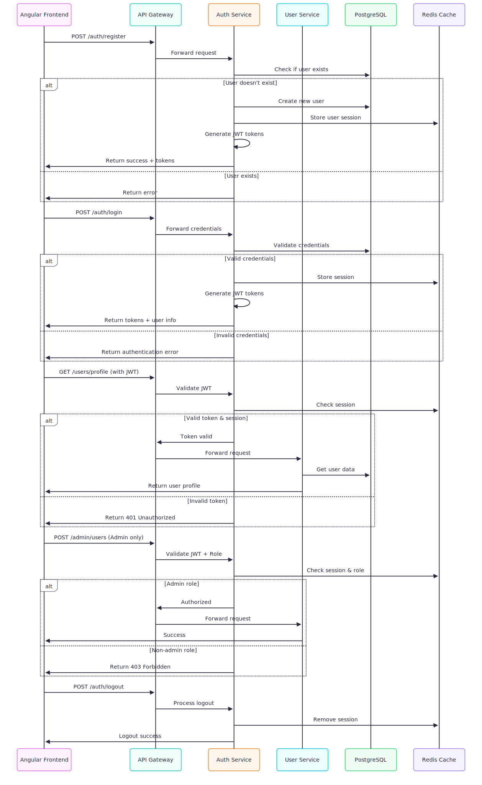

# Document Management and RAG Q&A - Frontend

This project is the Angular frontend for the Document Management and RAG Q&A application. It provides the user interface for authentication, document management, user administration, and interacting with the Q&A system.

## Application Architecture

The frontend is one part of a larger microservice-based system. It communicates with a suite of backend services to handle its functionality.



## Tech Stack

-   [Angular](https://angular.io/) (v15+)
-   [Angular Material](https://material.angular.io/) for UI components
-   [Tailwind CSS](https://tailwindcss.com/) for utility-first styling

## Prerequisites

-   [Node.js](https://nodejs.org/) (v18 or higher)
-   [npm](https://www.npmjs.com/) (v9 or higher)
-   [Angular CLI](https://angular.io/cli)

## Local Development Setup

### 1. Clone the Repository
Clone this repository and navigate into the root directory.

### 2. Install Dependencies
Install the necessary npm packages.
```bash
npm install
```

### 3. Run the Backend Services
This frontend requires the backend microservices to be running. Please follow the setup instructions in the `document-management-system` repository's README to start the backend stack using Docker Compose.

### 4. Start the Development Server
Run the following command to start the Angular development server.
```bash
ng serve
```
The application will be available at `http://localhost:4200/`. The server will automatically reload if you change any of the source files.

## Key Features

-   **Authentication:** User registration and login pages with JWT-based authentication.
-   **Document Dashboard:** A protected area for users to upload new documents (`.pdf`, `.docx`) and view/delete their existing ones.
-   **Ingestion Trigger:** A button to start the document processing pipeline for the RAG system.
-   **User Management (Admin):** A protected, admin-only area to perform full CRUD operations on all users in the system.
-   **Q&A Interface:** A page for users to ask questions and receive answers generated by the RAG system, with the ability to scope questions to specific documents.

## Running Unit Tests

This project comes with a full suite of unit tests for all major components using Jest. To run the tests, use the following command:
```bash
ng test
```
This will launch the test runner and execute all `*.spec.ts` files.
